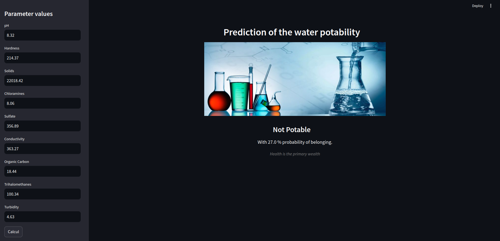

## This project is used to predict the potability of the water with their quality attributes.

#### Tools and language used during the realization :

-   os : Ubuntu
-   tools : VSCode
-   language : Python
-   package : Pycaret, sklearn and streamlit

